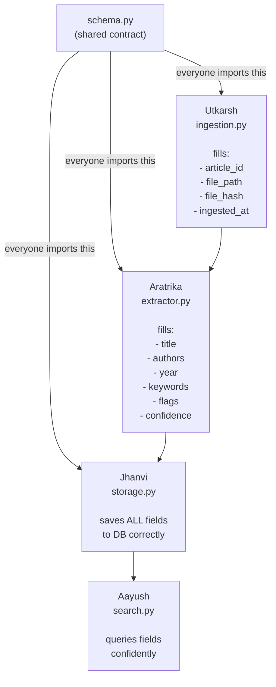

# PDF Library Organiser for Scientific Articles

This project aims to build an end-to-end pipeline to ingest, extract metadata from, store, and search a local library of scientific articles in PDF format. The system will enable efficient search and filtering by author, year, keyword, domain, and journal - with reproducible curation of a research database.

---

## Team Members

- Utkarsh - Ingestion & Integration Lead
- Aratrika - Metadata Extraction
- Jhanvi - Database & Storage
- Aayush - Search & Benchmarking

---

## Project Objective

The goal of this project is to organise a corpus of open-access scientific PDFs into a searchable, well-structured database. The system will handle:

- Automated metadata extraction from PDFs (title, authors, year, abstract, keywords)
- Duplicate detection and quality flagging
- Persistent storage in SQLite or CSV
- Search and filtering across the full library


## Pipeline Overview



---

## Data Sources

| Source | Domain | Format |
|--------|--------|--------|
| arXiv | Biology, Chemistry, Mathematics, Physics | `YYMM.NNNNNvN.pdf` |
| Nature Communications | Biology, Chemistry, Physics | `s41467-YYY-NNNNN-N.pdf` |
| BMC Bioinformatics | Biology | `JOURNAL-VOL-ARTICLE.pdf` |
| MDPI | Chemistry, Mathematics | `JOURNAL-VOL-ARTICLE-vN.pdf` |
| AMS Mathematics of Computation | Mathematics | `S0025-5718-YY-ARTICLE.pdf` |

The corpus will consist of **63 PDFs** across 4 domain folders: `biology/`, `chemistry/`, `mathematics/`, `physics/`. All files will be manually downloaded from open-access sources.

---

## Data Preprocessing Plan

### Ingestion
- Recursively scan all domain subfolders for `.pdf` files
- Compute MD5 hash of each file to detect and skip duplicates
- Classify filenames using regex patterns to identify publisher format and extract hints (arXiv ID, year, journal, article number)
- Assign research domain (`field`) from the subfolder name

### Metadata Extraction (3-stage fallback)

- **Stage A** - Read embedded PDF metadata (`/Title`, `/Author`, `/Keywords`, `/CreationDate`) using **PyPDF2** (primary). **pdfplumber** is used as a secondary fallback only - some PDFs expose metadata through pdfplumber that PyPDF2 misses. Garbage values are rejected (Word filenames, blank strings, corrupted text)
- **Stage B** - Use **pdfplumber** to extract raw text and character-level font data from the first page. Apply heuristics to locate title (largest font block), authors (lines between title and abstract), abstract, year, and keywords. PyPDF2 is not used here
- **Stage C** - Use filename hints as last resort (e.g. arXiv ID → year + journal, descriptive filename → title hint). No PDF library needed

### Flagging
Any field that cannot be extracted will be flagged (`missing_title`, `missing_authors`, `missing_abstract`, `year_uncertain`) for manual review later.

---

## Code Structure Plan

The project will be split into 5 modules, each owned by one team member:

### `schema.py`
Will define the shared\ article data model - a standard dictionary that all modules use as the common interface. Will include field validation, ID generation, and timestamp utilities.

### `ingestion.py` (Utkarsh)
- Scan the PDF folder and build a metadata skeleton for each file
- Detect duplicates via MD5 hashing
- Classify filenames and detect research domain
- Hand off to the extractor and storage modules

### `extractor.py` (Aratrika)
- Receive the skeleton dict from ingestion and fill all metadata fields
- Run Stage A → B → C extraction in order
- Normalise all fields (split author strings into lists, cast years to int)
- Add extraction flags for any missing fields

### `storage.py` (Jhanvi)
- Support two backends: SQLite and flat CSV
- `insert(article)` - saves one article dict to the DB
- `get(article_id)` - fetches a single record by ID
- `get_all()` - returns the full library as a DataFrame
- Build indexes on key fields for fast querying

### `search.py` (Aayush)
- Provide query functions: search by author, title, keyword, field, year, journal
- All functions will return a `pandas.DataFrame` for a consistent interface
- Will include a full-text search function and a combined multi-filter search

### `main.py` (Utkarsh)
- Tie all modules together into a single runnable pipeline
- Support CLI flags: `--folder`, `--backend`, `--reset-hashes`, `--dry-run`, `--search`, `--summary`
- Print a library dashboard after ingestion

---

## Testing and Debugging Plan

### Unit testing
Each module will be independently testable:
- `ingestion.py` - will support a `--dry-run` mode to scan and classify files without writing to the DB
- `extractor.py` - will support running on a single PDF file directly from the command line
- `storage.py` - will be tested by inserting a known article dict, retrieving it with `get()`, and verifying all fields round-trip correctly; will also test that `get_all()` returns the correct count and that switching backends (SQLite vs CSV) produces identical records
- `search.py` - will include a smoke test that runs all query functions against the live database

### Integration testing
- A full pipeline reset (`--reset-hashes`) will be used to re-ingest all PDFs from scratch and verify end-to-end correctness
- Counts will be checked against the known corpus (63 files found, 1 duplicate skipped, 62 ingested)
- Per-field article counts will be verified manually

### Debugging strategy
- All modules will use Python `logging` for per-step traceability
- Ingestion will write a detailed per-file log showing which extraction stage succeeded and which flags were raised
- Flagged records will be queryable from the database to identify patterns in extraction failures and guide fixes

---

## How to Run *(planned)*

```bash
# Install dependencies
pip install pdfplumber PyPDF2 pandas numpy

# Full pipeline (ingest all PDFs + show dashboard)
python main.py --folder /path/to/DSP_data

# Fresh re-ingest from scratch
python main.py --reset-hashes

# Dashboard only (no ingestion)
python main.py --summary

# Dry run (scan only, no DB writes)
python main.py --dry-run
```
